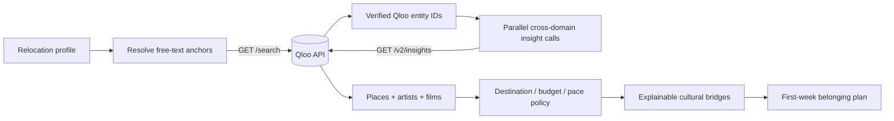

# Home2Here

**A cultural translation agent that turns what you love at home into a first-week belonging plan for a new city.**

Moving somewhere new is usually treated as a logistics problem. The harder part is often cultural: finding the places, sounds, stories, and small rituals that make a city feel livable. Search engines return what is popular. Home2Here starts with *you*.

Built for the Qloo Agentic Hackathon by **Rehan Raza**.

## Why this is a Qloo-native idea

Home2Here does not use Qloo as a decorative recommendation widget. Qloo is the cultural reasoning layer:

1. Free-text favorites are resolved into exact Qloo entities. Category hints distinguish same-name films and places; uncertain names are left unresolved rather than guessed.
2. Those entities become a shared taste signal.
3. `/v2/insights` translates that signal across places, artists, and films.
4. Destination and eligible place-price ceilings are applied as retrieval constraints; the app then removes out-of-city and clearly unsuitable first-week venues.
5. Qloo ranking and explainability, when available, are distinguished from the app's editorial planning.
6. The agent turns results into small first-week actions, sequenced differently for comfort, balance, or adventure.

A generic model can write a pleasant relocation list. It cannot reproduce Qloo's cross-domain affinity graph from the user's real cultural anchors.

## Product experience

- Three judge-ready relocation personas, plus a custom profile.
- Category-aware cultural anchors, verified against the live Qloo catalog (all nine sample anchors resolve).
- Cultural anchors across artists, films, books, brands, restaurants, and places.
- Cross-domain recommendations for places, music, and stories.
- Place-price and first-week pacing controls.
- A practical Day 1 → Weekend belonging plan.
- Per-result source labels; anchor-level evidence appears only when Qloo's explainability payload actually references an anchor.
- A second-turn feedback loop: “more like this” strengthens the signal; “not my vibe” excludes it; both force fresh results.
- Small server-side cache and request budget to protect the free event API allowance.
- A visible agent trace that separates resolution, retrieval, constraints, and planning.
- Transparent demo mode when a Qloo key is unavailable—never silently presented as live data.

## Architecture



The app is deliberately dependency-free: browser-native JavaScript, CSS, and a Node HTTP server. There is no paid model, database, analytics service, or account requirement for end users. The host needs a Qloo hackathon credential.

More detail: [Architecture notes](docs/ARCHITECTURE.md) and [evaluation protocol](docs/EVALUATION.md).

## Run locally

Requirements: Node.js 22.19 or newer.

```bash
npm start
```

Open `http://localhost:8080`. Without a key, the app starts in a clearly labelled illustrative mode for London, New York City, and Berlin. Other destinations require the live Qloo key; the app will not relabel one city's fixture as another.

For live Qloo results:

```bash
Copy-Item .env.example .env
# Add your hackathon key as QLOO_API_KEY.
npm start
```

The `npm start`, `npm run dev`, and `npm run evaluate` scripts load `.env` when present. The server reads:

- `QLOO_API_KEY` — required for live results; never sent to the browser.
- `QLOO_BASE_URL` — defaults to `https://hackathon.api.qloo.com`.
- `DEMO_FALLBACK` — defaults to `false`; set to `true` only when an explicitly labelled fixture fallback is desired.
- `PORT` — defaults to `8080`.

Official Qloo resources: [LLM Hackathon Developer Guide](https://docs.qloo.com/reference/qloo-llm-hackathon-developer-guide) and [Insights API Deep Dive](https://docs.qloo.com/reference/insights-api-deep-dive).

## Verify

```bash
npm test
npm run evaluate
```

The automated suite verifies entity normalization, API-key isolation, required Qloo parameters, category-aware resolution, destination filtering, cross-domain orchestration, validation, fallback disclosure, static delivery, and the complete plan endpoint.

`npm run evaluate` exercises all three canonical relocation profiles. Add `-- --require-live` to make the evaluation fail unless a live Qloo key is configured. In the 3 October 2026 live check, all three profiles resolved 3/3 anchors, returned 3/3 domains, and produced four first-week actions.

## Deploy

The project can run anywhere that supports Node 22.19+ or the included Dockerfile. `render.yaml` is included as a hosting template; verify a genuinely free plan is available before deploying, and add `QLOO_API_KEY` as a server-side secret. A public live app is mandatory for Qloo judging.

```bash
docker build -t home2here .
docker run --rm -p 8080:8080 -e QLOO_API_KEY=your_key home2here
```

Configure the API key as a server-side secret in the chosen host. Do not prefix it with `PUBLIC_`, expose it in browser JavaScript, or commit a `.env` file.
The included Render template sets `DEMO_FALLBACK=false` so a live API outage cannot quietly become a fixture-based judging demo. Render's free web service can spin down after inactivity, so the first judge visit may take around a minute to wake it; no paid upgrade is required for the prototype.

## Privacy, safety, and cost

- No signup, cookies, tracking, or stored user profile.
- The browser sends only the submitted relocation profile to this server.
- The Qloo key remains server-side.
- Inputs are length-limited and request bodies are capped.
- Repeated Qloo lookups are cached briefly, and expensive API routes have an in-memory per-client request budget.
- Demo fallback is explicitly disclosed in both the API and UI.
- The core product uses no paid dependency. Hosting should be placed on a no-cost allowance before submission.

## Repository map

```text
lib/               Qloo client, cultural bridge agent, demo fixtures
public/            Responsive product UI
scripts/           Reproducible evaluation harness
test/              Node test suite
server.mjs         HTTP server and API routes
```

## License

MIT © 2026 Rehan Raza
